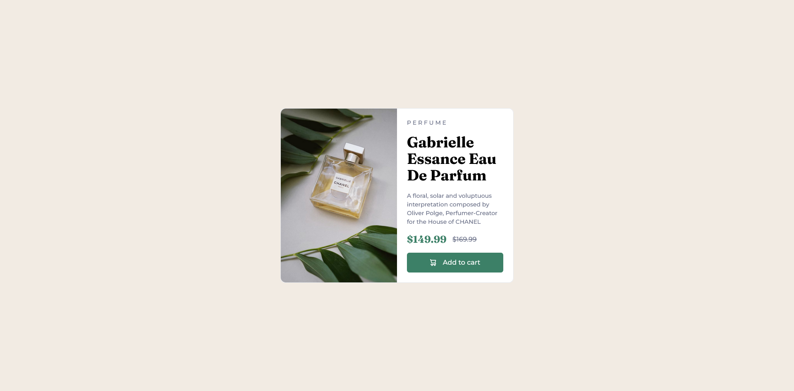
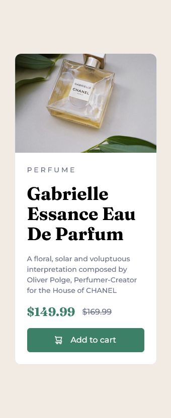

# Frontend Mentor - Product preview card component solution

This is a solution to the [Product preview card component challenge on Frontend Mentor](https://www.frontendmentor.io/challenges/product-preview-card-component-GO7UmttRfa). Frontend Mentor challenges help you improve your coding skills by building realistic projects. 

## Table of contents

- [Overview](#overview)
  - [The challenge](#the-challenge)
  - [Screenshot](#screenshot)
  - [Links](#links)
- [My process](#my-process)
  - [Built with](#built-with)
  - [What I learned](#what-i-learned)
  - [Continued development](#continued-development)
  - [Useful resources](#useful-resources)
- [Author](#author)
- [Acknowledgments](#acknowledgments)


## Overview

### The challenge

Users should be able to:

- View the optimal layout depending on their device's screen size
- See hover and focus states for interactive elements

### Screenshot
- Desktop View



- Mobile View



### Links

- Solution URL: [Add solution URL here](https://www.frontendmentor.io/solutions/product-preview-card-component-using-react-and-tailwind-rgMGVRfOck)
- Live Site URL: [Add live site URL here](https://frontend-mentor-challenge2-youssefjemmane.vercel.app/)

## My process

### Built with


- [React](https://reactjs.org/) - JS library
- [Tailwind](https://tailwindcss.com/) - For styles


### What I learned

In this challenge i learn how to set two images one for dektop view and one for mobile view using React hocks


```js
const [imageSrc, setImageSrc] = useState(imgd);
  useEffect(() => {
    const handleResize = () => {
      if (window.matchMedia("(max-width: 375px)").matches) {
        setImageSrc(imgm);
      } else {
        setImageSrc(imgd);
      }
    };
    handleResize();
    window.addEventListener("resize", handleResize);
    return () => window.removeEventListener("resize", handleResize);
  }, []);
```


### Useful resources

- [resource 1](https://chat.openai.com) - This website has helped me to understand how to set the images.

## Author

- Website - [YoussefJemmane](https://jemmane.vercel.app/)
- Frontend Mentor - [@YoussefJemmane](https://www.frontendmentor.io/profile/YoussefJemmane)

## Acknowledgments

I want to thank ChatGPT for helping me to understand how to set the images.